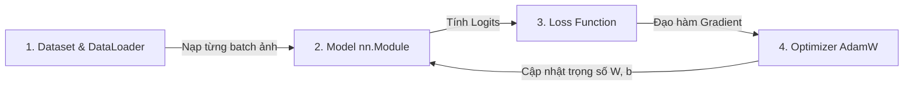

# 🎓 CẨM NANG NHẬP MÔN PYTORCH CHO NGƯỜI VỪA HỌC XONG THẦY ANDREW NG

> **Dành riêng cho bạn:** Đã học xong khoá *"Advanced Learning Algorithms"* (Course 2 - Machine Learning Specialization của thầy Andrew Ng) và muốn bước chân vào thế giới Deep Learning / Computer Vision thực chiến bằng **PyTorch** trên máy Mac M4.

---

## 🌟 PHẦN 1: CẦU NỐI TƯ DUY (TENSORFLOW $\longleftrightarrow$ PYTORCH)

Trong khoá của thầy Andrew Ng, m được học cách xây dựng mạng nơ-ron bằng **TensorFlow / Keras**. Keras rất tiện vì nó giấu hết mọi chi tiết phức tạp vào hàm `model.compile()` và `model.fit()`. 

Nhưng khi đi làm thực tế hoặc nghiên cứu AI hiện đại, **PyTorch** lại là "vua" vì nó cho m toàn quyền kiểm soát mọi phép toán, cực kì minh bạch và dễ debug.

### 🗺️ Bảng quy đổi "thần thánh":

| Khái niệm (Thầy Andrew Ng) | Code TensorFlow / Keras (Trong khoá học) | Code tương đương trong PyTorch | Bản chất toán học bên dưới |
| :--- | :--- | :--- | :--- |
| **Mảng dữ liệu** | `np.array` hoặc `tf.Tensor` | `torch.Tensor` | Mảng đa chiều, có thể nằm trên RAM (CPU) hoặc VRAM (GPU). |
| **Lớp nơ-ron Dense** | `Dense(units=128, activation='relu')` | `nn.Linear(in_features, 128)` + `nn.ReLU()` | Phép nhân ma trận $Z = XW + b$, sau đó qua hàm kích hoạt $A = \max(0, Z)$. |
| **Hàm mất mát đa lớp** | `loss = SparseCategoricalCrossentropy(from_logits=True)` | `criterion = nn.CrossEntropyLoss()` | Tính xác suất Softmax rồi tính hàm Cross-Entropy: $L = -\log(p_{\text{đúng}})$. Cả 2 đều nhận **Logits** chưa qua Softmax để ổn định số học! |
| **Thuật toán tối ưu** | `optimizer = tf.keras.optimizers.Adam(0.001)` | `optimizer = torch.optim.Adam(model.parameters(), lr=0.001)` | Cập nhật trọng số theo công thức Gradient Descent kết hợp Momentum và RMSprop. |
| **Duỗi phẳng ảnh** | `Flatten()` hoặc `X.reshape(-1, 400)` | `nn.Flatten()` hoặc `x.view(batch_size, -1)` | Biến ảnh nhiều chiều thành 1 vector hàng dọc dài để nhét vào lớp Dense. |
| **Huấn luyện mô hình** | `model.fit(X, y, epochs=10)` | Tự viết vòng lặp `for epoch`: `loss.backward()` & `optimizer.step()` | Trong PyTorch, m tự bấm nút kích hoạt lan truyền ngược (Backpropagation) và cập nhật $W, b$. |

---

## 🧠 PHẦN 2: TẠI SAO PHẢI LÀ CNN MÀ KHÔNG PHẢI MẠNG DENSE CỦA THẦY ANDREW?

Trong Week 2 của khoá học, thầy Andrew cho m nhận diện số viết tay 0-9 bằng cách duỗi thẳng ảnh 20x20 thành vector 400 số rồi cho qua lớp `Dense`:
```python
# Cách của thầy Andrew Ng (Mạng MLP / Dense truyền thống):
model = Sequential([
    Dense(25, activation='relu'),
    Dense(15, activation='relu'),
    Dense(10, activation='linear')
])
```

### ❌ Vấn đề chí mạng khi dùng Dense cho ảnh lớn:
1. **Nổ số lượng tham số (Parameter Explosion):**
   * Ảnh của dataset mình là ảnh màu **64x64x3 = 12,288 điểm ảnh (pixels)**.
   * Nếu m dùng 1 lớp `Dense(128)` ngay đầu tiên, chỉ riêng ma trận trọng số $W$ đã ngốn:  
     $$12,288 \times 128 \approx 1,570,000 \text{ tham số (weights)!}$$
     Chỉ 1 lớp thôi đã hơn 1.5 triệu biến cần học $\rightarrow$ Model sẽ cực kì nặng, dễ bị Overfitting (học vẹt) và chạy rất chậm.
2. **Mất cấu trúc không gian (Spatial Structure):**
   * Khi m duỗi thẳng ảnh thành vector 1D, điểm ảnh góc trên bên trái sẽ bị tách rời hoàn toàn khỏi điểm ảnh ngay bên dưới nó. Model bị "mù" khái niệm: bên trái, bên phải, nét cong, góc nhọn!

### 💡 Giải pháp cứu cánh: CNN (Convolutional Neural Network)
CNN mô phỏng cách mắt người và não bộ nhìn thế giới qua 3 tuyệt chiêu:
1. **Bộ lọc quét ảnh (Convolutional Filter / Kernel):**
   * Thay vì nối mọi điểm ảnh vào 1 nơ-ron, CNN dùng một ô vuông nhỏ kích thước **3x3** (gọi là Kernel) trượt từ từ qua khắp bề mặt bức ảnh.
   * Lớp đầu tiên chỉ học bắt các nét cực đơn giản: nét thẳng ngang, nét sổ dọc, đường chéo.
   * Lớp tiếp theo ghép các nét lại để bắt: góc nhọn, đường tròn, móc câu.
   * Lớp sâu hơn ghép thành chữ cái hoàn chỉnh: chữ 'A', số '8',...
2. **Chia sẻ trọng số (Parameter Sharing):**
   * Cùng 1 cái filter 3x3 đó (chỉ có $3 \times 3 = 9$ số weights) được dùng để quét toàn bộ bức ảnh. Do đó chữ 'A' nằm ở góc trái hay góc phải thì filter đều nhận ra như nhau (Translation Invariance).
   * Giúp số lượng tham số giảm cả trăm lần so với lớp Dense!
3. **Thu nhỏ dần bằng Max Pooling:**
   * Sau mỗi tầng quét, ta dùng `MaxPool2d(2, 2)` để lấy giá trị lớn nhất trong mỗi ô 2x2. Ảnh sẽ giảm kích thước 1 nửa: $64 \times 64 \rightarrow 32 \times 32 \rightarrow 16 \times 16 \rightarrow 8 \times 8 \rightarrow 4 \times 4$.
   * Việc này giúp model chắt lọc lấy tinh hoa và nhìn bức ảnh ở góc độ tổng quát hơn.

---

## 🏗️ PHẦN 3: 4 TRỤ CỘT BẤT DI BẤT DỊCH CỦA PYTORCH

Mọi dự án PyTorch trên thế giới đều xoay quanh 4 thành phần này:



### 1. Tensor (Đơn vị cơ bản)
* `torch.Tensor` hệt như `numpy.ndarray`, nhưng có thêm 2 siêu năng lực:
  * Chuyển dc lên GPU để tính toán song song cực nhanh: `tensor.to("mps")`.
  * Tự động nhớ lịch sử phép toán để tính đạo hàm ngược (Autograd).

### 2. Dataset & DataLoader (Quản lý dữ liệu)
* `Dataset`: Nơi lưu trữ hoặc đọc ảnh từ đĩa (ví dụ đọc từ file `dataset_train.h5`). M chỉ cần định nghĩa 2 hàm:
  * `__len__(self)`: Báo cho PyTorch biết có bao nhiêu ảnh.
  * `__getitem__(self, idx)`: Lấy ra ảnh thứ `idx` kèm nhãn đúng của nó.
* `DataLoader`: Người vận chuyển! Nó tự động bốc dữ liệu theo từng lô (**Mini-batch**, ví dụ 256 ảnh một lúc), xáo trộn ngẫu nhiên (**shuffle**) và dùng đa tiến trình CPU để nạp vào GPU k bị ngắt quãng.

### 3. Model (`nn.Module`)
Trong PyTorch, model luôn là 1 class kế thừa từ `nn.Module`. Nó có 2 hàm bắt buộc:
* `__init__(self)`: Khai báo các tầng mạng m muốn dùng (`Conv2d`, `Linear`, `ReLU`,...).
* `forward(self, x)`: Định nghĩa luồng dữ liệu đi qua các tầng mạng theo thứ tự.

### 4. Vòng lặp huấn luyện thần thánh (The 5 Golden Steps)
Trong hàm `model.fit()` của TensorFlow, nó âm thầm chạy đúng 5 bước này cho từng batch:

```python
# 5 BƯỚC VÀNG TRONG VÒNG LẶP PYTORCH:
optimizer.zero_grad()   # Bước 1: Xoá sạch đạo hàm cũ của batch trước
outputs = model(images) # Bước 2: Forward pass (Tính dự đoán của model)
loss = criterion(outputs, labels) # Bước 3: Tính Loss (Độ sai lệch)
loss.backward()         # Bước 4: Backward pass (Tính đạo hàm dJ/dw bằng Backpropagation)
optimizer.step()        # Bước 5: Gradient Descent (Cập nhật w = w - learning_rate * dJ/dw)
```

---

## ⚡ PHẦN 4: GPU APPLE SILICON (MPS) TRÊN MAC M4 HOẠT ĐỘNG NHƯ THẾ NÀO?

Trước đây dân AI bắt buộc phải có card NVIDIA chạy CUDA. Nhưng từ khi Apple ra mắt chip Apple Silicon (M1, M2, M3, M4), Apple đã bổ sung backend **MPS (Metal Performance Shaders)** vào PyTorch.

* **Kiến trúc Unified Memory:** Trên Mac M4, CPU và GPU dùng chung 1 cụm RAM băng thông siêu rộng (hơn 100 GB/s). Do đó việc đẩy ảnh từ RAM sang GPU diễn ra gần như tức thì.
* **Cách kích hoạt trong code:**
  ```python
  device = torch.device("mps" if torch.backends.mps.is_available() else "cpu")
  model = model.to(device)
  images, labels = images.to(device), labels.to(device)
  ```
  Chỉ cần 3 dòng này là toàn bộ phép nhân ma trận triệu chiều sẽ chạy trên hàng chục nhân GPU của chip M4!

---

## 🛠️ PHẦN 5: BÍ KÍP CHẨN ĐOÁN & TINH CHỈNH THEO THẦY ANDREW NG (WEEK 3)

Trong Week 3 của khoá học, thầy Andrew Ng nhấn mạnh việc chẩn đoán **Bias (Underfitting)** và **Variance (Overfitting)**. Khi m train file `train.py`, hãy nhìn vào 2 con số: **Train Loss/Acc** và **Val Loss/Acc**:

### 🔴 Trường hợp 1: High Bias (Underfitting - Model quá ngây thơ)
* **Dấu hiệu:** Cả Train Acc và Val Acc đều thấp (ví dụ chỉ lẹt đẹt ở mức 60% - 70%).
* **Nguyên nhân:** Mạng quá bé, không đủ khả năng học quy luật phức tạp của 2M ảnh.
* **Cách sửa trong `train.py`:**
  1. Tăng số lượng bộ lọc: sửa `32 -> 64 -> 128` thành `64 -> 128 -> 256`.
  2. Tăng số nơ-ron ở lớp fully-connected: sửa `Linear(256, 128)` thành `Linear(256, 256)`.
  3. Tăng số Epoch lên (ví dụ từ 10 lên 15 - 20 epochs).

### 🔵 Trường hợp 2: High Variance (Overfitting - Model học vẹt)
* **Dấu hiệu:** Train Acc cực kì cao (99%), nhưng Val Acc lại thấp lè tè (75% - 80%). Model nhớ vẹt ảnh train nhưng gặp ảnh val là đoán bậy.
* **Cách sửa chuẩn bài thầy Andrew Ng:**
  1. **Tăng Dropout:** Sửa `Dropout(0.4)` thành `Dropout(0.5)` để ép model không được phụ thuộc vào bất kì nơ-ron đơn lẻ nào.
  2. **Tăng Regularization:** Sửa `WEIGHT_DECAY = 1e-4` thành `1e-3` (đây chính là hệ số phạt L2 $\frac{\lambda}{2m}\sum w^2$ mà thầy Andrew giảng trong bài Regularization).
  3. **Data Augmentation:** Tin vui là bộ dataset 2M mẫu của tụi mình đã có sẵn Albumentations xoay, nghiêng, nhiễu hạt nên khả năng Overfitting cực kì thấp!

### 🟢 Trường hợp 3: Loss nhảy loạn xạ hoặc nổ NaN
* **Nguyên nhân:** Learning Rate quá lớn.
* **Cách sửa:** Giảm `LEARNING_RATE = 1e-3` (0.001) xuống `3e-4` (0.0003).

---

## 🚀 TÓM TẮT: QUY TRÌNH M BẮT ĐẦU CHẠY NGAY HÔM NAY

1. Mở file `train.py` lên đọc lướt qua một lượt. M sẽ thấy các khối code giờ đây cực kì quen thuộc với những gì vừa đọc ở trên.
2. Mở Terminal tại thư mục project và gõ:
   ```bash
   python train.py
   ```
3. Quan sát thanh tiến trình `tqdm` chạy vù vù trên GPU chip M4.
4. Xem bảng kết quả đánh giá cuối cùng và các bức ảnh đoán thử ở hàm `demo_inference`!
