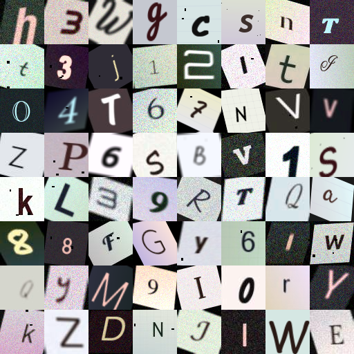
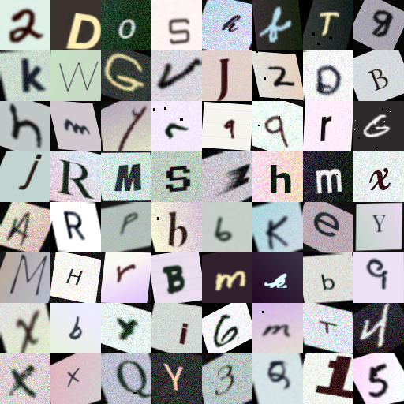

# Detect Letter - Bộ Nhận Diện Kí Tự Đơn Lẻ (62 Classes)

Dự án huấn luyện mạng nơ-ron tích chập (Convolutional Neural Network - CNN) bằng **PyTorch** để nhận diện kí tự đơn lẻ (chữ hoa `A-Z`, chữ thường `a-z`, số `0-9` - tổng cộng 62 classes) hoặc 36 classes (không phân biệt hoa thường).

Hỗ trợ sinh dataset tổng hợp quy mô hàng triệu ảnh siêu tốc từ Google Fonts, System Fonts kết hợp chữ viết tay thực tế EMNIST, áp dụng Albumentations đa dạng và lưu trữ định dạng HDF5 (`.h5`) tối ưu bộ nhớ.

---

## Preview Dữ Liệu Sinh Ra

| Dữ liệu tổng hợp (Fonts + Augmentations) | Kết hợp chữ viết tay EMNIST |
| :---: | :---: |
|  |  |

---

## Điểm Nổi Bật

- **Sinh dữ liệu siêu tốc & đa dạng (`generate_dataset.py`):**
  - Tận dụng `multiprocessing` và `Shared Memory` (zero-copy) để sinh hàng triệu ảnh mà không tràn RAM.
  - Hàng trăm font từ Google Fonts và System Fonts (Sans-serif, Serif, Monospace, Cursive/Handwriting, Display).
  - Biến đổi nền phong phú: màu bệt ngẫu nhiên, gradient xoay góc, giấy kẻ ngang (lined), giấy kẻ ô vuông (grid), nhiễu hạt giấy.
  - Giả lập nét bút: co/giãn nét (dilation/erosion) mô phỏng bút bi, bút dạ, bút chì.
  - Pipeline Albumentations (C++): xoay, biến dạng phối cảnh 3D, motion blur, nhiễu cảm biến, nén JPEG, xước mực.
  - Tích hợp dataset chữ viết tay thực tế EMNIST ByClass.
  - Lưu trữ dưới dạng HDF5 (`.h5`) nén LZF: tránh nghẽn I/O hệ thống tệp khi làm việc với 1M–2M mẫu.

- **Dataloader & Kiến trúc CNN tối ưu (`dataset_loader.py` & `train.py`):**
  - PyTorch `Dataset` hỗ trợ lazy opening an toàn 100% khi chạy DataLoader đa luồng (`num_workers > 0`).
  - Kiến trúc CNN chuẩn: Conv2d $\rightarrow$ BatchNorm2d $\rightarrow$ ReLU $\rightarrow$ MaxPool2d $\rightarrow$ Dropout $\rightarrow$ Linear.
  - Tối ưu tăng tốc phần cứng: tự động nhận diện Apple Silicon GPU (`mps`), NVIDIA GPU (`cuda`), hoặc `cpu`.
  - Checkpoint tự động lưu model tốt nhất (`best_model.pth`) dựa trên Validation Accuracy.

- **Cẩm nang chi tiết (`HUONG_DAN_PYTORCH.md`):**
  - Hướng dẫn nhập môn PyTorch chi tiết từ lý thuyết (so sánh với TensorFlow/Keras của thầy Andrew Ng) đến thực hành trên máy Mac M4.

---

## Hướng Dẫn Cài Đặt & Sử Dụng

### 1. Cài đặt môi trường

Khuyến nghị dùng Python 3.10+ và tạo virtual environment:

```bash
# Tạo môi trường ảo
python3 -m venv .venv
source .venv/bin/activate

# Cài đặt các thư viện cần thiết
pip install -r requirements.txt
```

### 2. Tải Font chữ

Chạy script tải tự động các font từ Google Fonts và quét font hệ thống:

```bash
python download_fonts.py
```

### 3. Tải Dataset chữ viết tay EMNIST (Tuỳ chọn)

Nếu muốn bổ sung dữ liệu chữ viết tay EMNIST ByClass (tải đa luồng siêu tốc từ HuggingFace):

```bash
python download_emnist.py
```

### 4. Xem trước mẫu sinh dữ liệu (Preview)

Kiểm tra độ đa dạng trước khi tạo dataset lớn:

```bash
# Preview font tổng hợp
python preview.py --rows 8 --cols 8 --output preview.png

# Preview kết hợp chữ viết tay EMNIST
python preview.py --rows 8 --cols 8 --use-emnist --output preview_emnist.png
```

### 5. Sinh Dataset (HDF5)

Sinh tập dữ liệu mẫu huấn luyện và kiểm thử:

```bash
# Tổng 120,000 mẫu (mặc định tách 10% làm tập val) — hỗ trợ multiprocessing
python generate_dataset.py \
  --num-samples 120000 \
  --val-split 0.1 \
  --workers 8
```

**Trộn chữ viết tay EMNIST theo tỉ lệ tuỳ ý** — ví dụ 70% chữ in từ font + 30% chữ viết tay:

```bash
python generate_dataset.py \
  --num-samples 120000 \
  --val-split 0.1 \
  --use-emnist \
  --emnist-ratio 0.3 \
  --workers 8
```

- `--use-emnist`: bắt buộc phải có thì `--emnist-ratio` mới có hiệu lực.
- `--emnist-ratio`: tỉ lệ mẫu viết tay EMNIST (0.0 → 1.0). `0.3` = 30% viết tay + 70% chữ in từ font.
- `--num-samples`: tổng số mẫu (train + val). `--val-split`: tỉ lệ tách tập val (mặc định 0.1).

*(Mẹo: Dùng flag `--case-insensitive` nếu chỉ cần phân loại 36 class: 0-9 và A-Z).*

### 6. Huấn luyện mô hình (Training)

Chạy huấn luyện mạng CNN:

```bash
python train.py
```

Mô hình sẽ tự động chọn thiết bị tốt nhất (MPS trên Apple Silicon Mac hoặc CUDA trên máy có GPU NVIDIA) và lưu trọng số tốt nhất vào `dataset/best_model.pth`.

---

## Cấu Trúc Thư Mục

```text
detect-letter/
├── data/                  # Thư mục chứa EMNIST data (git ignored)
├── dataset/               # Thư mục chứa dataset HDF5 và checkpoints (git ignored)
├── fonts/                 # Thư mục fonts chữ (git ignored, tải qua script)
├── .gitignore             # Quy tắc loại trừ file không cần thiết
├── requirements.txt       # Danh sách dependencies
├── download_fonts.py      # Script tải Google Fonts & quét System Fonts
├── download_emnist.py     # Script tải EMNIST ByClass đa luồng từ HuggingFace
├── generate_dataset.py    # Script sinh dataset HDF5 siêu tốc
├── dataset_loader.py      # PyTorch Dataset Loader & kiến trúc CNN
├── train.py               # Script huấn luyện CNN
├── preview.py             # Script tạo ảnh lưới xem trước dữ liệu
├── preview.png            # Ảnh mẫu dữ liệu font tổng hợp
├── preview_emnist.png     # Ảnh mẫu dữ liệu kết hợp EMNIST
├── HUONG_DAN_PYTORCH.md   # Cẩm nang chi tiết PyTorch cho người mới bắt đầu
└── README.md              # Tài liệu dự án
```

---

## License

Dự án phục vụ mục đích học tập và nghiên cứu.
